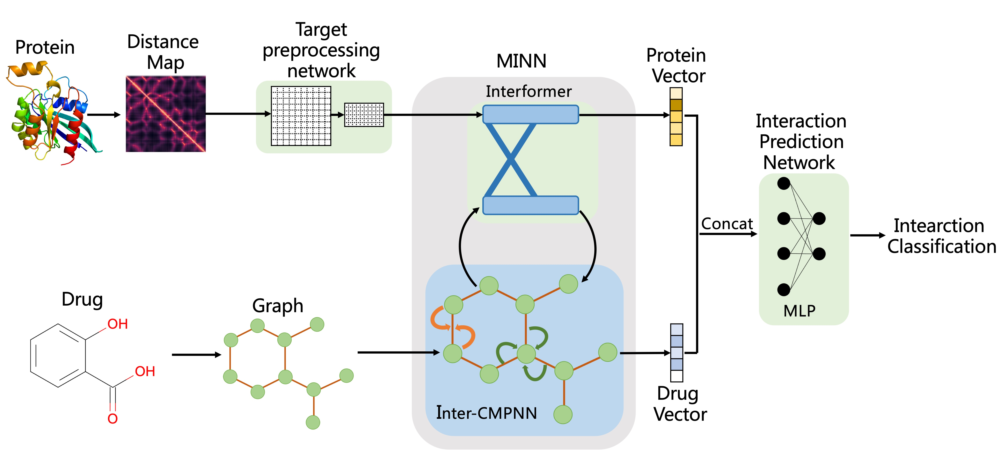

# Effective drug-target interaction prediction with mutual interaction neural network

## MINN-DTI
* Source code for the paper "Effective drug-target interaction prediction with mutual interaction neural network".

* MINN-DTI is a model for drug-target interaction (DTI) prediction. MINN-DTI combines an interacting-transformer module (called Interformer) with an improved Communicative Message Passing Neural Network (CMPNN) (called Inter-CMPNN) to better capture the two-way impact between drugs and targets, which are represented by molecular graph and distance map respectively.


* The code was built based on [DrugVQA](https://github.com/prokia/drugVQA), [CMPNN](https://github.com/SY575/CMPNN) and [transformerCPI](https://github.com/lifanchen-simm/transformerCPI). Thanks a lot for their code sharing!

## Dataset
All data used in this paper are publicly available and consistent with that used by DrugVQA , which can be accessed here : [DrugVQA](https://github.com/prokia/drugVQA).

## Environment
* base dependencies:
```
  - dgl
  - dgllife
  - numpy
  - pandas
  - python>=3.7
  - pytorch>=1.7.1
  - rdkit
```
* We also provide an environment file for Anaconda users. You can init your environment by ```conda env create -f environment.yaml```.
* Need download the chemprop package from [CMPNN](https://github.com/SY575/CMPNN) and put it in model/ directory.

## Usage
### Training on datasets uesd in this paper
#### Data and file directory preparation
* Before training a model on the datasets uesd in this paper, you must prepare data and file directory as follows (take DUD-E as an example):
  * 1. Select or create your local data directory for the DUD-E dataset, such as `data/DUD-E`.
  * 2. Download `data/DUDE/contactMap` and `data/DUDE/dataPre` directories including proetin contact maps, SMIELS and labels from [DrugVQA repository](https://github.com/admislf/drugVQA/tree/master/data/DUDE).
  * 3. Put the downloaded `contactMap` and `dataPre` folders in your data directory(`data/DUD-E`)
#### Set arguments
* All default arguments are provided in the [model/data.py](./model/data.py) for training.
* You can modify the [model/data.py](./model/data.py) directly to set up your model
* The following arguments must be set according to your data directory
```python
# Path of training data file
trainFoldPath = '../data/DUDE/dataPre/DUDE-foldTrain1'
# Directory of protein contact maps
contactPath = '../data/DUDE/contactMap'
# Path of the protein contact map dict file
contactDictPath = '../data/DUDE/dataPre/DUDE-contactDict'
```

#### Run your training
* Run any one command below using [model/main.py](./model/main.py) to train a model, model files will be saved in `model_pkl/my/`
```shell
$ python model/main.py
# Specify GPU
$ CUDA_VISIBLE_DEVICES=0 python model/main.py
# Running in the background
$ nohup python model/main.py > train.log 2>&1 &
$ CUDA_VISIBLE_DEVICES=0 nohup python model/main.py > train.log 2>&1 &
```
### Training on independent datasets
* You can train your model on your own datasets Follow the steps above.
* The only thing you need to do is organize your data in the format used here, you have to:
  * Prepare a training data file like [this file](https://raw.githubusercontent.com/admislf/drugVQA/master/data/DUDE/dataPre/DUDE-foldTrain1)
  * Prepare a protein contact map dict file like [this file](https://github.com/admislf/drugVQA/blob/master/data/DUDE/dataPre/DUDE-contactDict)
  * Prepare protein contact maps like [this file](https://raw.githubusercontent.com/admislf/drugVQA/master/data/DUDE/contactMap/abl1_2f4jA_full)
  * Specify the path of the above files in [model/data.py](./model/data.py) as `Set arguments` in `Training on datasets uesd in this paper` section bove

### Testing on datasets uesd in this paper
#### Data and file directory preparation
* Before testing a model, you must prepare data and file directory
  * Besides `contactMap` and `dataPre` folders, you need to download `decoy_smile` and `active_smile` folders from [DrugVQA repository](https://github.com/admislf/drugVQA/tree/master/data/DUDE) and put them in your data directory.
#### Set arguments
* All default arguments are provided in the [model/dataTest.py](./model/dataTest.py) for testing.
* You can modify the [model/dataTest.py](./model/dataTest.py) directly to set up your testing
* The following arguments must be set according to your data directory
```python
# Path of test list file
testFoldPath = '../data/DUDE/dataPre/DUDE-foldTest1'
# Directory of protein contact maps
contactPath = '../data/DUDE/contactMap'
# Path of the protein contact map dict file
contactDictPath = '../data/DUDE/dataPre/DUDE-contactDict'
# Directory of SMILES file of active or decoy molecules
DECOY_PATH = '../data/DUDE/decoy_smile'
ACTIVE_PATH = '../data/DUDE/active_smile'
```
#### Run your testing
* Run any one command below using [model/mainTest.py](./model/mainTest.py) to test your models, results including AUC and other indicators will be written in `test.log`
```shell
# Running in the background
# Setting model file: ../model_pkl/my/DUDE-fold-h0501-235.pkl 
$ nohup python model/mainTest.py .py --checkpoint_path ../model_pkl/my/DUDE-fold-h0501-235.pkl 2>&1 > test.log
# Specify GPU
$ CUDA_VISIBLE_DEVICES=0 nohup python model/mainTest.py .py --checkpoint_path ../model_pkl/my/DUDE-fold-h0501-235.pkl 2>&1 > test.log
```
### Testing or predicting on independent datasets
* To test or predict on independent datasets you need to organize your data in the format used here:
   * Prepare protein contact maps and contact map dict file as above
   * Prepare a test list of target names separated by spaces(named mytest here)
   * Put lists of active SMILES and decoy SMILES named XXX_actives_final.ism and XXX_decoys_final.ism (XXX is target name in test list `mytest`) of targets in `active_smile` and `decoy_smile` folds Separately with one SMILES per line (named active_smile and decoy_smile), put them all in active_smile for prediction task.
* Modify the following arguments in [model/dataTest.py](./model/dataTest.py)
```python
# Path of test list file
testFoldPath = '../data/DUDE/dataPre/mytest'
# Directory of protein contact maps
contactPath = '../data/DUDE/contactMap'
# Path of the protein contact map dict file
contactDictPath = '../data/DUDE/dataPre/DUDE-contactDict'
# Directory of SMILES file of active or decoy molecules
DECOY_PATH = '../data/DUDE/decoy_smile'
ACTIVE_PATH = '../data/DUDE/active_smile'
```
* Run any one command below using [model/mainTest.py](./model/mainTest.py) to test your models, testing and predicting results including predicting results of each sample will be written in `mytest.log`
```shell
# Running in the background
# Setting model file: ../model_pkl/my/DUDE-fold-h0501-235.pkl 
$ nohup python model/mainTest.py .py --checkpoint_path ../model_pkl/my/DUDE-fold-h0501-235.pkl 2>&1 > mytest.log
# Specify GPU
$ CUDA_VISIBLE_DEVICES=0 nohup python model/mainTest.py .py --checkpoint_path ../model_pkl/my/DUDE-fold-h0501-235.pkl 2>&1 > mytest.log
```
